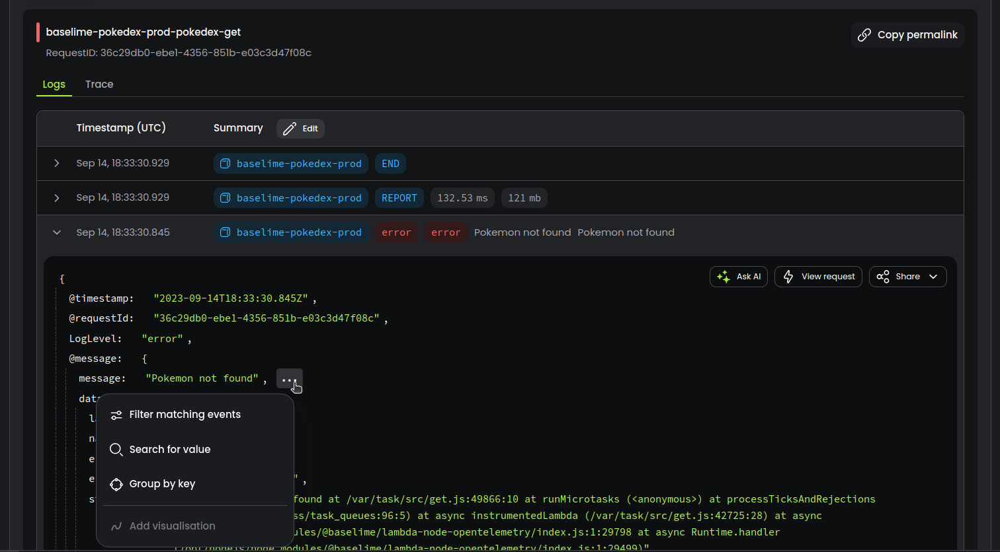
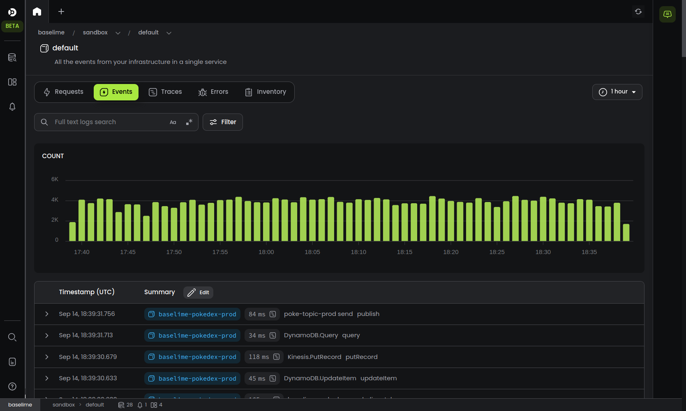
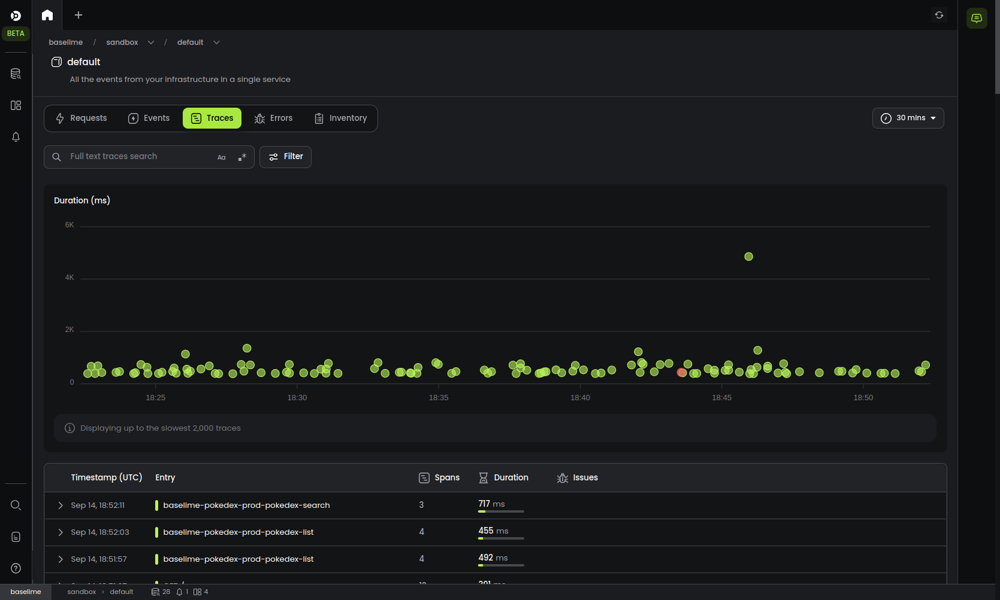
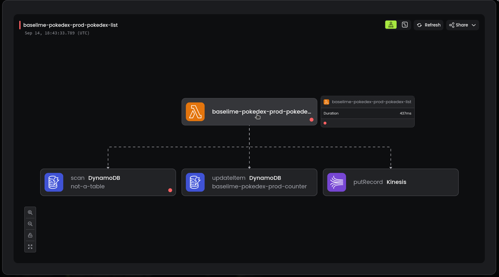
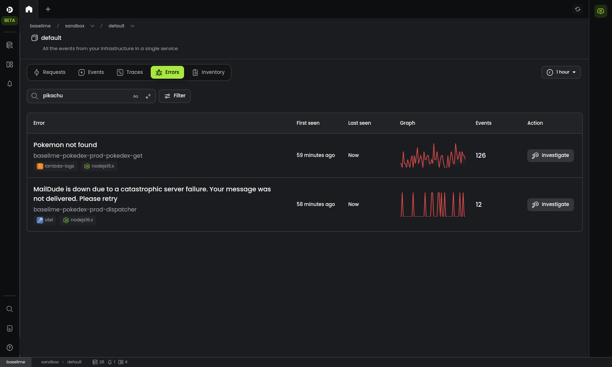
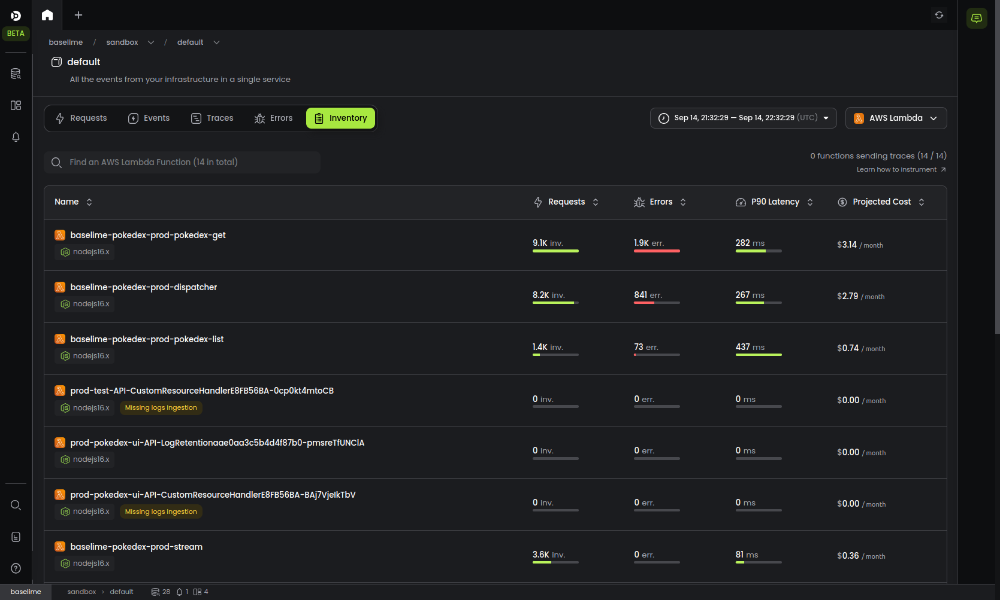

# Service Home

---

Every service in Baselime has a service home. The service home is where you get both a high-level overview of your service as well as the ability to drill down and investigate issues quickly.

---

## Requests

The requests view displays a summary of your requests and the list of the requests within the selected timeframe in chronological order.

### Summary

The summary includes three charts:
- **Number of events**: the total number of events your service emitted
- **Errors**: the total number of errors in your telemetry data
- **Request latencies** the 90th percentile latencies of requests and traces

You can drill down on any of these charts by clicking on the chart. It opens the Baselime query builder where you can slice and dice your data further. 

### List of requests

Below the summary charts, there is a search bar, a filter button and the list of requests.

You can search for any string or regular expression using the search bar. Baselime will search through all the events (logs, spans, span events and wide events) from your service and display the requests where at least one event matches the search criteria.

You can filter by any high-dimensionality field in your data using the filter button. Baselime fill filter through all the events (logs, spans, span events and wide events) from your service and display the requests where at least one event matches the applied filters.

If you add simultaneously a search criteria and filters, Baselime will find events that matches all searches and filters and displat the corresponding requests.

You can expand each request and view the logs and the trace of the request. Also, to facilitace filtering, it's possible to filter directly from the logs or the trace of a request. Use the option menu at the end of each line in the events JSON.

!!!
The menu inside the JSON event is available across Baselime, wherever an event is displayed. This enables you to quickly go from an event to investigating further, without loosing the context of the event.
!!!

---

## Events

The events view displays all the events your service emitted during the selected timeframe. The events comprise all logs, spans, span events, wide-events and metrics sent to Baselime.

You can search for events and filter events from this view. You can zoom in on the bar chart of the event volume.

---

## Traces

The traces view displays the traces found in your service within the selected timeframe. It includes a trace scatter plot, where the y-axis is the duration of the traces and the x-axis is the timestamp. In addition to the scatter plot, the trace view displays a list of traces from your service in chronological order.

You can search and filter traces using the search bar and the filter button.

The scatter plot is color-coded:

- Red: traces with at least one span with an error
- Green: succesful traces
- Blue: Traces where there is a cold-start (for serverless functions)

You can click on any of the dots in the scatter plot to display the trace.

You can also click on any of the traces in the list to display the complete trace.

Once you're viewing a trace, you can click on any of the spans to view the the span the logs of the traces, the span events, and the span details.

---

## Errors

The error view displays a list of all errors that have occured in your service, alongside metadata about the error.

You can search for, or filter errors that match a set of criteria.

Once you've identified an error you want to investigate further, click on the "Investigate" button to quickly get the context around the error, for example the requests or traces the error occured in, or more metadata around the error.

!!!
Baselime automatically detects errors from your telemetry data.
!!!

---

## Inventory

The inventory view displays a set of lists of cloud-resources available in your service. Currently, the available resources are:

- AWS Lambda Functions
- Amazon ECS Services
- Amazon DynamoDB Tables

We're continiously adding more cloud services to the inventory view.

From the inventory view, you can navigate to any individual cloud resource.