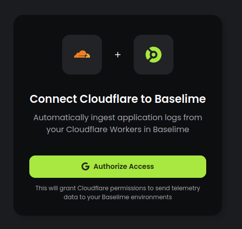

# API Integration

Integrate with Baselime to programatically interact with Baselime.

The Baselime API Integration enable the creation of appplications that can interact with Baselime's observability platofrm on behalf of developers.

---

## Getting Started

To create an API integration, get in touch with the Baselime Team via email at [techies@baselime.io](mailto:techies@baselime.io).

Provide the following details:

| Field       | Description                                                       |
| ----------- | ----------------------------------------------------------------- |
| Integation Name        | The name of the your application                                       |
| Description | A short description of your application                         |
| Logo Icon        | A `.svg` file for the icon of your application                                      |
| Redirect URL    | The URL to redirect developers after they install your integration on Baselime. |

The Baselime team will create an your application integration and provide you with unique Client ID and a Client secret. The Client ID is required to for developers to install your integration on Baselime. The Client Secret is necessary for authenticating developers from Baselime in your application.

!!!
Your integration will be available at `https://console.baselime.io/integrations/<your-client-id>`. 
!!!



--- 

## OAuth Authentication

Once a developer installs your integration on Baselime, they will be redirected to the Redirect URL of your integration, with a temporary authorization code appended to the query string parameters of the URL, such as `https://your-redirect-url?code=<temporary-auth-code>`.

!!!
The temporary authorization code is valid for 3 minutes.
!!!

### Request an Access Token

Once the developer is redirected to your provided Redirect URL, use the temporary authorization code to retrieve a short-lived access token for first-time access.

- Send a `POST` request to the token endpoint URL
- Set the `Content-Type` header to `applications/json`
- Add a `HTTP Body` containing the Client ID and Client Secret along with your Redirect URL, the temporary authorization code and the `grantType` parameter set to `authorization_code`.

```bash # :icon-terminal: terminal
curl -X 'POST' 'https://api.baselime.io/oauth/token' \
  -H 'Content-Type: application/json' \
  -d '{
        "grantType": "authorization_code",
        "clientId": "<your-client-id>",
        "clientSecret": "<your-client-secret>",
        "redirect": "<your-redirect-url>",
        "code": "<oauth-code>"
      }'
```

The response will return an Access Token valid for **24 hours**.

```json #
{
  "accessToken": "0eg45oih65ihj4gjiojerjoi3g45j0g4",
  "refreshToken": "435huo4wwwwwhu9j4398653g9woeirjgq3984ig5whrek5ejh9jg9wehgw",
  "expiresIn": 86400,
  "tokenType": "Bearer"
}
```

### Request a Refresh Token

The response to theaccess token call also includes a long-lived Refresh Token. Use the refresh token to request a new Access Token when the access token expires. To generate a new Access Token using the Refresh Token, send a `POST` request to the token endpoint URL, add the Refresh Token to the request body and change the `grantType` parameter to `refresh_token`.

```bash # :icon-terminal: terminal
curl -X 'POST' 'https://api.baselime.io/oauth/token' \
  -H 'Content-Type: application/json' \
  -d '{
        "grantType": "refresh_token",
        "clientId": "<your-client-id>",
        "clientSecret": "<your-client-secret>",
        "redirect": "<your-redirect-url>",
        "refreshToken": "<refresh-token>"
      }'
```

The response will return a new Access Token valid for 24 hours.

```json #
{
  "accessToken": "0eg45oih65ihj4gjiojerjoi3g45j0g4",
  "expiresIn": 86400,
  "tokenType": "Bearer"
}
```

---

## Using the API

To enable sending events from your application to Baselime, it's necessary to obtain a public API key from the developer Baselime account.

### Request a Public API Key

In Baselime, each public API key is linked to an environment. This ensure the public API key can be used to send events to a single environment.

Use the list environments endpoint to list all the environments using the Access Token.

- Send a `GET` request to the environments endpoint URL
- Set the `Content-Type` header to `applications/json`
- Set the `Authorization` header to `Bearer <ACCESS_TOKEN>`. Replace `<ACCESS_TOKEN>` with the Access Token obtained during authentication

```bash # :icon-terminal: terminal
curl 'https://api.baselime.io/oauth/environments' \
  -H 'Content-Type: application/json' \
  -H 'Authorization: Bearer <ACCESS_TOKEN>' 
```
The response will return an array containing the list of environments the developer has access to in their Baselime account. Each environment will be composed of:

- **workspaceId**: The ID of the workspace that the environment is a part of.
- **environmentId**: The ID of environment.
- **apiKey**: A public API key that can be used to send events to the environment.

```json #
[
  {
    "workspaceId": "my-workspace",
    "environmentId": "prod",
    "apiKey": "abc123def456"
  },
  ...
]
```

### Send events to Baselime

Once you have obtained the public API for an environment, it can be used to send events to Baselime, either using the [Events API](../sending-data/events-api.md) or the [OpenTelemetry API](../sending-data/platforms/opentelemetry/opentelemetry.md).