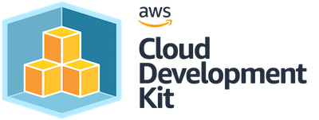

Observability is a first class citizen of your infrastructure with Baselime. You
can use the [AWS CDK](https://aws.amazon.com/cdk/) to define and automate your observability
configurations in Baselime.



---

## Installation

Download the [Baselime CDK](https://github.com/baselime/cdk) on npm:
[`@baselime/cdk`](https://www.npmjs.com/package/@baselime/cdk)

+++ npm

```
npm i --save-dev @baselime/cdk
```

+++ yarn

```
yarn add -D @baselime/cdk
```

+++ pnpm

```
pnpm i --save-dev @baselime/cdk
```

+++

---

## Configuration

Initialise the Baselime CDK with your Baselime API Key.

Get your API Key from the [Baselime console](https://console.baselime.io). Make sure to select an `Admin` API Key. Admin API keys have the permissions to create resources in your Baselime account.

```typescript # :icon-code: index.ts
import { Baselime } from "@baselime/cdk";

Baselime.init(this, {
  apiKey: `<BASELIME_API_KEY>`,
});
```

---

## Example alert

Set up an alert everytime there's an error in your application logs:

```typescript # :icon-code: index.ts
import { Alert, filter } from "@baselime/cdk";

new Alert("service-errors", {
  parameters: {
    query: {
      filters: [
        filter.inArray("LogLevel", ["ERROR", "WARN"]),
      ],
    },
    channels: [{ type: "slack", targets: ["baselime-alerts"] }]
  },
});
```

This alert will notify you on Slack when there is an event with `LogLevel` equal `"ERROR"` in your telemetry data.
