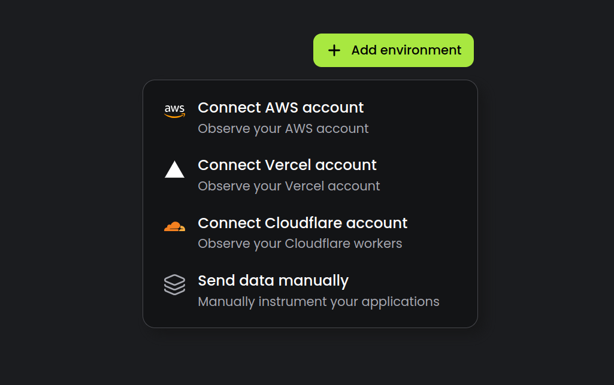

# Quick Start Guide

---

## Step 1: Sign up for Baselime

You can sign up for a free Baselime account [here](https://console.baselime.io).

---

## Step 2: Add an Environment

You can add an environment by connecting your cloud account, or by creating an environment manually to send data manually to Baselime.




---

## Step 3: Send a log event (optional)

If you created an environment manually, execute this `cURL` command to send your first log event to Baselime.

Replace your `BASELIME_API_KEY` with the API key your got from step 2.

```bash # :icon-terminal: terminal
curl -X 'POST' 'https://events.baselime.io/v1/logs/my-service/my-namespace' \
  -H 'x-api-key: $BASELIME_API_KEY' \
  -H 'Content-Type: application/json' \
  -d '[
        {
          "message": "This is an example log event",
          "error": "TypeError: Cannot read property 'something' of undefined",
          "requestId": "6092d6f0-3bfa-4d62-9d0b-5bc7ae6518a1",
          "data": {"key1": "an example metadata"}
        },
        {
          "message": "This is another example log event",
          "requestId": "6092d6f0-3bfa-4d62-9d0b-5bc7ae6518a1",
          "data": {"userId": "01HBRCB38K2K4V5SDR7YC1D0ZB"},
          "duration": 127
        }
      ]'
```

---

## Step 4: Explore your data

Congratulations! Your first event should be available to query in Baselime. You can start exploring your data using the [Baselime console](https://console.baselime.io), the [Baselime CLI](./cli/install.md) or any other of our clients.


---

## Guides

- [Sending Data](./sending-data/): Learn how to ingest telemetry data from your cloud-native applications
- [Analyzing Data](./analysing-data/overview.md): Discover how to use the various interfaces provided by Baselime to analyze and understand your data


---
## Reference

- [Baselime CDK Reference Guide](./oac/cdk/quick-start.md): Learn about how to use Baselime with the AWS CDK to define your Observability as Code
- [ORL Reference Guide](./oac/observability-reference-language/overview.md): Learn about the Baselime Observability Reference Language (ORL) and how to use it to define observability configurations
- [CLI Reference](./cli/install.md): Complete reference for the Baselime command-line interface

---
## Community

Join the Baselime community to get help with using the platform, share your own experiences, and stay up-to-date with the latest developments.

- [Slack](https://join.slack.com/t/baselimecommunity/shared_invite/zt-1eu7l0ag1-wxYXQV6Fr_aiB3ZPm3LhDQ): Join our Slack community to connect with other Baselime users and get real-time support from the Baselime team
- [Blog](https://baselime.io/blog): Read about the latest features, best practices, and more from the Baselime team
- Social media: Follow us on [Twitter](https://twitter.com/baselimeHQ), [LinkedIn](https://www.linkedin.com/company/baselime), and [YouTube](https://youtube.com/@baselimedev) to stay up-to-date with the latest news and updates from Baselime

We look forward to connecting with you!