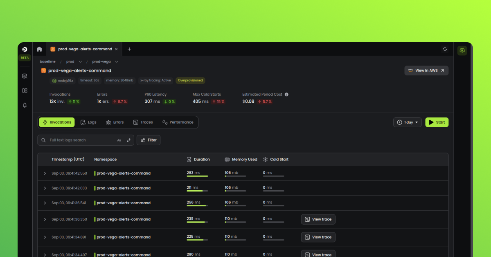

# Quick Start Guide

---

## Step 1: Sign up for Baselime

Sign up for a free Baselime account in the [Baselime console](https://console.baselime.io).

---

## Step 2: Add an Environment

You can add an environment by connecting your cloud account, or by creating an environment manually to send data manually to Baselime.

Select "Send data manually" for this quick start.


---

## Step 3: Send log events

Execute this `cURL` command to send your first log event to Baselime.

!!!
Replace `BASELIME_API_KEY` with the API key your got from step 2.
!!!

```bash # :icon-terminal: terminal
curl -X 'POST' 'https://events.baselime.io/v1/logs' \
  -H 'x-api-key: $BASELIME_API_KEY' \
  -H 'Content-Type: application/json' \
  -H 'x-service: my-service' \
  -d '[
        {
          "message": "This is an example log event",
          "error": "TypeError: Cannot read property 'something' of undefined",
          "requestId": "6092d6f0-3bfa-4d62-9d0b-5bc7ae6518a1",
          "namespace": "https://api.domain.com/resource/{id}"
        },
        {
          "message": "This is another example log event",
          "requestId": "6092d6f0-3bfa-4d62-9d0b-5bc7ae6518a1",
          "data": {"userId": "01HBRCB38K2K4V5SDR7YC1D0ZB"},
          "duration": 127
        }
      ]'
```

---

## Step 4: Explore your data

Congratulations! Your first event should be available to query in Baselime. You can start exploring your data using the [Baselime console](https://console.baselime.io) or the [Baselime CLI](./cli/install.md).

Explore how to [connect various data sources](./sending-data/) to Baselime and get full-stack observability across your applications.



---

## Guides

- [Sending Data](./sending-data/): Learn how to ingest telemetry data from your applications
- [Analyzing Data](./analysing-data/overview.md): Discover how to use the various interfaces provided by Baselime to analyze and understand your data

---
## Community

Join the Baselime community to get help with using the platform, share your own experiences, and stay up-to-date with the latest developments.

- [Slack](https://join.slack.com/t/baselimecommunity/shared_invite/zt-2iqnawlfl-jODT1lZMyq8b5YH5qhZ5ew): Join our Slack community to connect with other Baselime users and get real-time support from the Baselime team
- [Blog](https://baselime.io/blog): Read about the latest features, best practices, and more from the Baselime team
- Social media: Follow us on [Twitter](https://twitter.com/baselimeHQ), [LinkedIn](https://www.linkedin.com/company/baselime), and [YouTube](https://youtube.com/@baselimedev) to stay up-to-date with the latest news and updates from Baselime

We look forward to connecting with you!