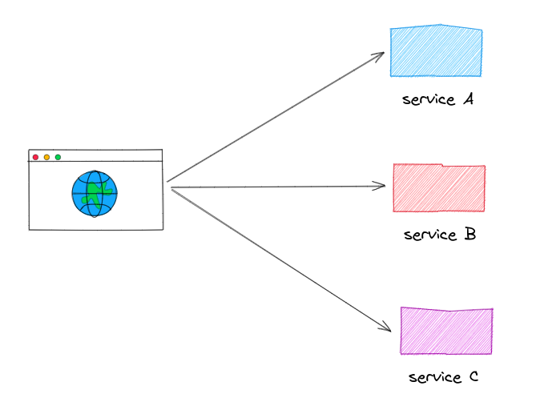
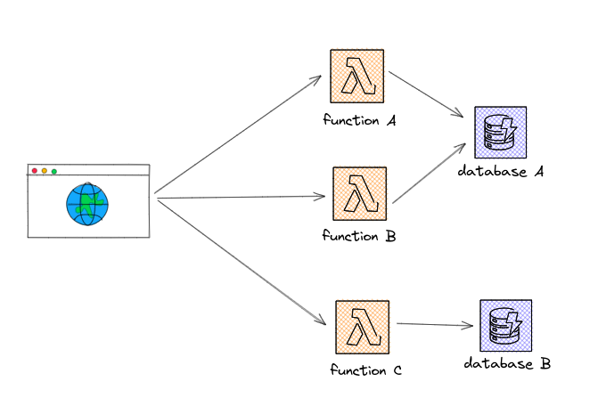
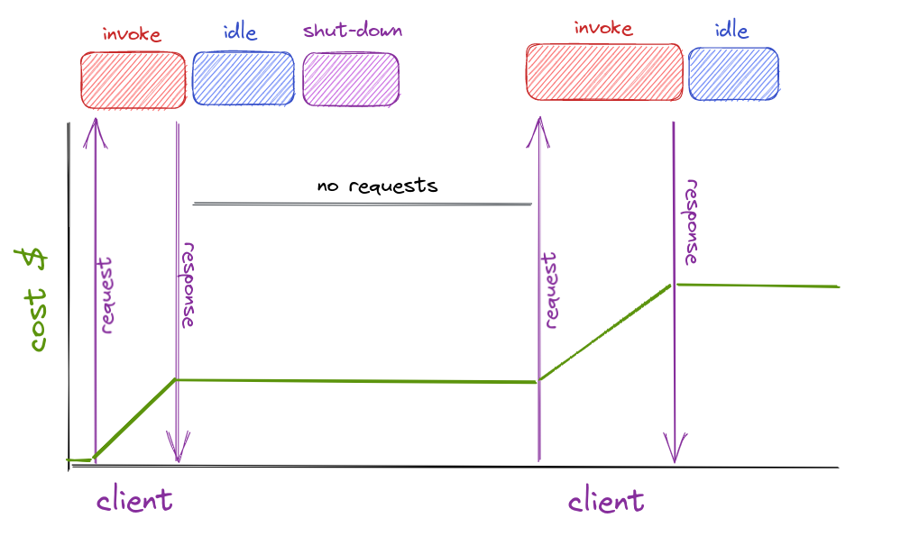
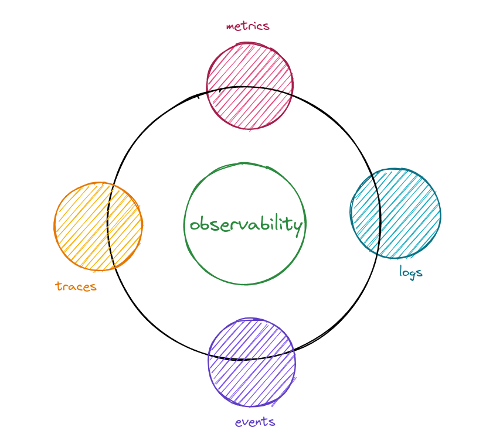
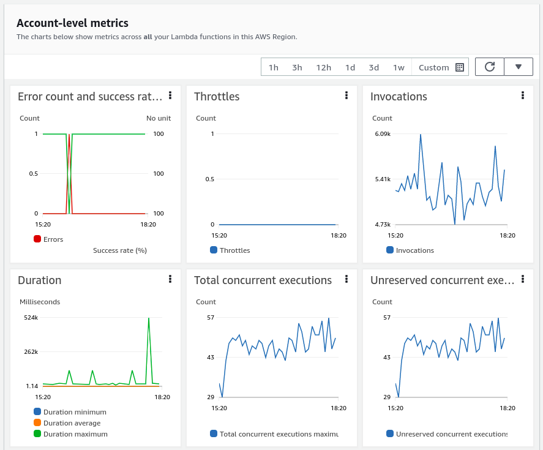
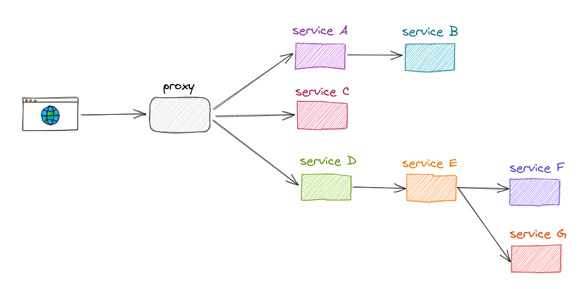
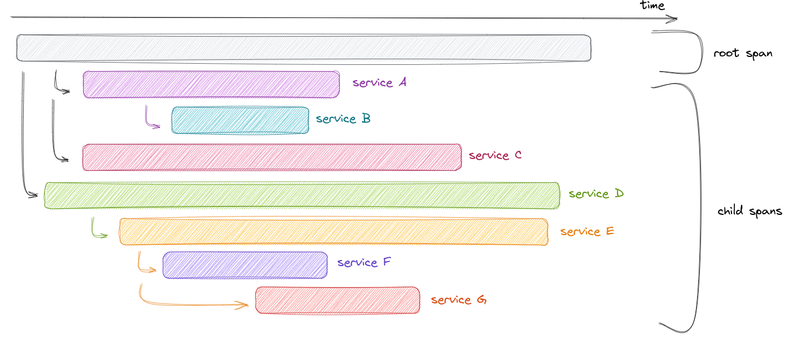
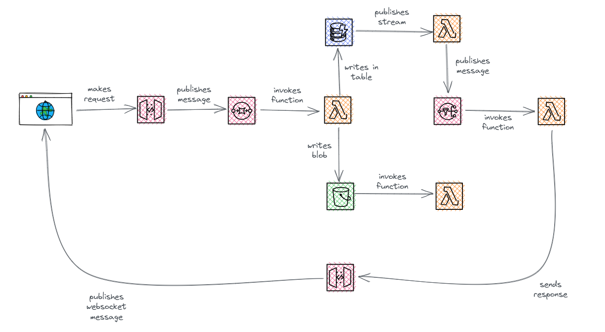

# Observability for Serverless

---

# 1. Introduction

Serverless architectures have gained momentum with engineers building distributed systems. However, due to their stateless, ephemeral nature, they are difficult to observe with standard observability approaches. Investigating bugs typically turns into crime scenes, piecing together data from multiple sources to get a blurry image of the root cause of the issue.

Baselime is an observability solution for serverless architectures. It enables developers to unlock key insights from their serverless architectures through the use of telemetry data. 

---

# 2. What is serverless?

## 2.1. Microservices

Microservices are a software development approach where an application is built as a collection of small, independent services that communicate with each other over a network. Each service performs a specific business function and can be deployed, scaled, and updated independently of the other services. Microservices are designed to be loosely coupled and use standard interfaces to communicate with other services.

The benefits of microservices include improved scalability, fault tolerance and resilience, as well as easier deployment and maintenance.

## 2.2. Serverless

Serverless computing is a cloud computing model where the cloud provider manages and allocates computing resources dynamically based on the demand of the application. In this model, the user does not need to manage or provision any servers, as the provider manages everything related to infrastructure.

The serverless model is event-driven and is commonly used for short-lived functions or applications that need to scale up or down quickly, such as in response to sudden traffic spikes. The application logic is broken down into small functions that can be executed independently, and each function is triggered by an event, such as an API request, a change in a database, or a message from a message queue.

The pricing model for serverless computing is based on the number of requests and the duration of execution, rather than on the underlying infrastructure. This makes it a cost-effective option for applications with unpredictable or variable workloads.

### 2.2.1 Functions-as-a-Service (FaaS)

Functions as a Service (FaaS) is a cloud computing model where a cloud provider manages and runs small code functions in response to specific events or requests. FaaS enables developers to write and deploy individual functions performing a well-defined task as a response to an event. Once the event is triggered, the cloud provider spins up a new instance of the function, runs the code the developer wrote, and returns the result.

In this model, the cloud provider allocates compute resources only when required. When there’s an increase in traffic, more resources are allocated, and when traffic goes down, resources are deallocated. As such, developers don’t need to provision compute and storage resources in advance, or anticipate spikes in traffic with over-provisioning, as is typically the case in traditional architectures.

The ephemeral, auto-scaling and pricing model of FaaS enables developers to accelerate development cycles, as they are freed from the challenges of provisioning, troubleshooting and maintaining servers.

### 2.2.2 Troubleshooting

In the serverless computing model, accessing and modifying the infrastructure, typically within the cloud provider's environment, can be limited. This can make it challenging for developers to collect data about the behaviour of their applications. Unlike traditional servers, serverless services are managed and scaled by the cloud provider so developers need to adopt different strategies for collecting data about performance, errors and other metrics.

These strategies may include using logging and monitoring tools provided by the cloud provider, adding custom instrumentation to the application code, and implementing distributed tracing techniques to track requests across multiple services. By using these strategies, developers can gain insights into the behaviour of their serverless applications and optimize their performance and scalability.

---

# 3. What is Observability?

Observability is the ability to understand and measure the internal state of a system based on its external outputs, achieved through instrumentation.

Imagine you are a developer responsible for maintaining a large e-commerce application that experiences frequent outages and performance issues. You have a hard time pinpointing the root cause of these issues because you lack visibility into the internal state of the application. You are unable to tell what happens to a customer's order when it goes through multiple services, and you struggle to identify which component is causing the slowdown. This is where observability comes in.

Observability is like turning on the lights in a dark room. Without it, developers are working in the dark, struggling to diagnose issues and maintain the health of the system. Observability provides the necessary tools and techniques for developers to gain visibility into the system's internal workings, allowing them to diagnose issues and optimize performance.

**Telemetry data** is at the heart of observability. Developers need to instrument their systems with various tools that collect and analyze telemetry data. This data may include logs, metrics, traces, and events among other things.

Metrics can include things like the number of requests served, the latency of each request, and the memory usage of each service. Logging enables developers to capture important events and metrics, such as error messages and service availability, while tracing enables them to follow the path of a request through multiple services. By using these observability techniques, developers can quickly diagnose issues and improve the overall health and performance of the system.

## 3.1 Logs

Application logs are time-stamped messages capturing a pre-defined event about an application's behaviour. In a cloud-based environment, where applications are distributed across multiple servers and services, application logs are essential for developers to gain visibility into the system and quickly diagnose issues.

However, text based logs are pretty bad at providing insights into the entire lifecycle of a request or event throughout the entire distributed system. This is why we encourage that you log structured JSON events that provide detailed information about what the application code has been doing. From this you can more easily build an understanding about the state of the system. The [`@baselime/lambda-logger`](https://github.com/baselime/lambda-logger) helps you apply these best practices in a tiny package. 

## 3.2 Metrics

Application metrics capture quantitative measurements of an application's behavior and performance aggregated over a defined period of time. These metrics provide developers with valuable insights into how the application is performing, how resources are being utilized, and how users are interacting with the system.

Examples of application metrics include response time, error rate, throughput and resource utilization, which can be tracked and analyzed to identify areas for optimization and improvement.

Metrics can give a signal to indicate a defect, but they lack the granularity necessary to pinpoint the root cause of the issue.

## 3.3 Traces

Distributed tracing is a technique used to track the path of a request or event as it travels through a complex distributed system, consisting of multiple interconnected services and components. This involves capturing and correlating data from each service involved in processing the request, including information about service dependencies, communication protocols and processing times.

Let’s look at a typical distributed application:

The diagram above tells us what components are part of the application, but it doesn’t tell us how the request propagates through the system, which services are performance bottlenecks and which can be optimised. Distributed tracing shines in those scenarios:

The trace above consists of multiple components, each referred to as a span. A span represents a unit of work and its associated processing time. The root span is the first span in the trace and typically represents a request's lifecycle from start to finish. The subsequent spans are child spans, each representing a specific unit of work within the request's journey.

From the trace, we can identify that the calls to `service F` and `service G` can be made in parallel, which will make the call to `services D and E` shorter, ultimately resulting in a faster response to the client.

One of the key ingredients of distributed tracing is their ability to propagate metadata about the request from parent spans to child spans. This context propagation provides developers with a detailed view of how requests flow through the system and enables faster troubleshooting and debugging of complex distributed applications, as well as easier performance optimization.

---

# 4. Challenges of Observability for Serverless

Observability for serverless can pose several challenges for developers. One of the major issues is the stateless and ephemeral nature of serverless functions, which makes it harder to pinpoint and troubleshoot issues related to specific requests or users. Serverless platforms abstract much of the underlying infrastructure, reducing the visibility into the runtime environment, and making it harder to troubleshoot issues when they inevitably occur.

Additionally, the event-driven nature of serverless applications can exacerbate the observability challenge. In contrast to traditional HTTP-based architectures, serverless functions very often communicate with each other through event brokers like message queues, event buses or event streams, introducing new complexities, such as asynchronous processing, message ordering, and event aggregation. The non-linear path of event-driven architectures can make it more difficult to trace requests, especially when multiple services consume and produce events asynchronously.

Event-driven serverless systems bring unique challenges that developers must address:

- Context propagation: context propagation is critical to creating a complete trace of the request's lifecycle. Events must carry the context of upstream services and propagate it to downstream services and functions. This context propagation needs to account for the specificity of each event bus, queue or stream to create an unbroken trace across the lifecycle of the request.
- Identity and Access Management: Identity and access management (IAM) is essential to ensure each service in the architecture has the necessary permissions to interact with other components. Improperly configured IAM can lead to process failures that are difficult to track.
- Metrics: Metrics provide valuable context about requests and services that should not be ignored. Developers must observe each service used to communicate between serverless functions through metrics and logs when available.

To overcome these challenges, developers can leverage tools like AWS CloudTrail, which enables them to track IAM activities and diagnose operational issues.

