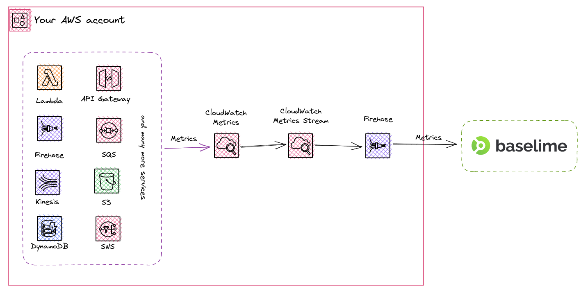

# Amazon CloudWatch Metrics

Once you connect your AWS account to Baselime, the necessary resources including a [CloudWatch Metrics Stream](https://docs.aws.amazon.com/AmazonCloudWatch/latest/monitoring/CloudWatch-Metric-Streams.html) and a [Kinesis Firehose](https://aws.amazon.com/kinesis/data-firehose/) will be automatically created and configured for you. This means that you don't need to do any additional setup or configuration.

!!! Essential
Sending Amazon CloudWatch metrics to Baselime is essential to effectively monitor your AWS resources and applications. By ingesting CloudWatch metrics, Baselime can provide real-time analysis and visualization of your application's performance, health, and availability. This allows you to quickly identify and troubleshoot issues before they impact your users.
!!!

!!! Automatic
Baselime automatically ingests Amazon CloudWatch Metrics, there is no need for any additional steps after connecting your AWS account.
!!!

---

## Why Amazon CloudWatch Metrics ?

[Amazon CloudWatch](https://aws.amazon.com/cloudwatch/) is a monitoring service provided by Amazon Web Services (AWS) that enables you to collect and track metrics and log data for your AWS resources and applications. Metrics are important as they provide insight into the performance and behavior of your serverless applications and the underlying infrastructure.

Amazon CloudWatch Metrics can help you identify issues such as high error rates and latencies, which can help improve the overall reliability and scalability of your applications.

Moreover, Amazon CloudWatch Metrics cover all aspects of your serverless architecture automatically, from DynamoDB tables to S3 buckets and SQS Queues.

---

## How it works

The following diagram illustrates the process for sending Amazon CloudWatch metrics to Baselime. Once Baselime is connected to an AWS Account, it automatically created the telemetry pipeline for ingesting Amazon CloudWatch metrics into Baselime. The pipeline comprises a CloudWatch Metrics Stream, a Kinesis Firehose and all IAM roles and permissions associated.

This pipeline will automatically continiously send metrics from your AWS account to Baselime.

!!! AWS Cost
Amazon CloudWatch Metrics Stream might incur a minimal cost on your AWS accont. AWS charges $0.003 per 1,000 metric updates. Refer to the [AWS docs](https://aws.amazon.com/cloudwatch/pricing/) for more details.
!!!

---

## Custom Amazon CloudWatch Metrics

Baselime automatically ingests all metrics published to Amazon CloudWatch. This includes both standard Amazon CloudWatch metrics and any [custom metrics](https://docs.aws.amazon.com/AmazonCloudWatch/latest/monitoring/publishingMetrics.html) that you may have created.

There is no need to manually configure or set up anything to start ingesting custom Amazon CloudWatch metrics. Once your AWS account is connected, all metrics will be available for querying in Baselime.

---

## Querying Amazon CloudWatch Metrics

Once your AWS account is connected to Baselime, you can use any of the our clients to visualize and query your Amazon CloudWatch Metrics. You'll have access to all the metrics available in your AWS account, and you can use the [Observability Reference Language (ORL)](../oac/observability-reference-language/overview.md) to filter and aggregate the data in near real-time.

---

## Troubleshooting

If you're having trouble sending metrics from Amazon CloudWatch to Baselime, here are a few things to check:

- Verify that your AWS account is correctly connected to Baselime and you receive data in other datasets such as [AWS Lambda Logs](./lambda-logs.md) or [CloudTrail Events](./cloudtrail.md)
- Check that the Kinesis Firehose created in your AWS account as part of the Baselime connection has the appropriate API key to connect with the Baselime backend. If the API key is missing, please contact us.
