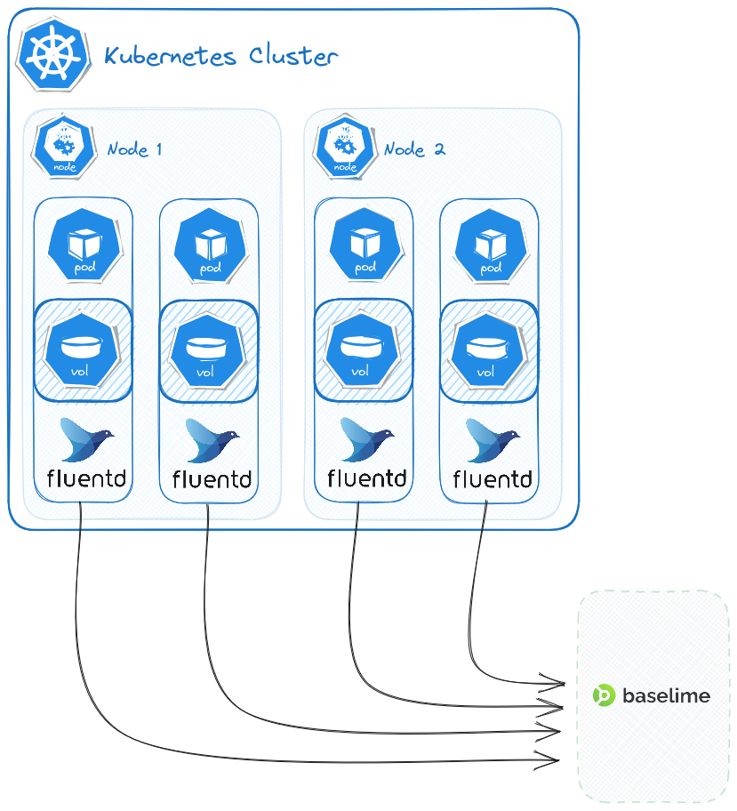

You can forward your Kubernetes logs to Baselime by using Fluentd as your logging driver.

---

#### What is Fluentd?
Fluentd is an open source data collector for unified logging layer that is widely used
by the companies such as AWS, Google, Microsoft, and more.

#### How to use Fluentd with Baselime?

To forward all Kubernetes logs to Baselime you will need to configure a DaemonSet
to run Fluentd on each node in your cluster. The Fluentd DaemonSet will be configured
to use the Baselime HTTP endpoint as the Fluentd output.

First we need to create a ConfigMap that will contain the Fluentd configuration.
```yaml # :icon-code: config.yaml
apiVersion: v1
kind: ConfigMap
metadata:
  name: fluentd-config
data:
  fluent.conf: |
    <source>
      @type tail
      path /var/log/containers/*.log, /var/log/pods/*.log
      exclude_path ["/var/log/containers/fluentd-*.log"]
      pos_file /var/log/fluentd-containers.log.pos
      tag container_logs
      <parse>
        @type regexp
        expression /^(?<log>.*)$/
      </parse>
    </source>
    <match>
      @type http
      endpoint https://events.baselime.io/v1/kubernetes-logs
      headers {"x-api-key":"YOUR_API_KEY"}
      open_timeout 2
      <format>
        @type json
      </format>
    </match>
```

Make sure to replace YOUR_API_KEY with the API key you obtained from the Baselime console.

Next we need to create a DaemonSet that will run Fluentd on each node in your cluster.
```yaml # :icon-code: daemonset.yaml
apiVersion: apps/v1
kind: DaemonSet
metadata:
  name: fluentd
  labels:
    k8s-app: fluentd-logging
    version: v1
spec:
  selector:
    matchLabels:
      k8s-app: fluentd-logging
      version: v1
  template:
    metadata:
      labels:
        k8s-app: fluentd-logging
        version: v1
    spec:
      containers:
        - name: logger
          image: fluent/fluentd-kubernetes-daemonset:v1.11.5-debian-elasticsearch7-1.1
          env:
            - name: FLUENTD_ARGS
              value: -c /fluentd/etc/fluent.conf
          volumeMounts:
            - mountPath: /fluentd/etc
              name: config-volume
            - name: varlog
              mountPath: /var/log
            - name: dockercontainerlogdirectory
              mountPath: /var/lib/docker/containers
              readOnly: true
      volumes:
        - name: varlog
          hostPath:
            path: /var/log
        - name: config-volume
          configMap:
            name: fluentd-config
            items:
              - key: fluent.conf
                path: fluent.conf
        - name: dockercontainerlogdirectory
          hostPath:
            path: /var/lib/docker/containers
```

Apply those two YAML files to your cluster and you should start seeing your Kubernetes logs
in Baselime.

#### Logs format
The logs are sent to Baselime in the following format.
```json
{
  "message": "This is a message from ",
  "timestamp": 1697109850,
  "service": "service_name",
  "namespace": "namespace_name"
}
```

You can add extra fields or leave the `service` and `namespace` fields empty, defaulting them
to the "default" service and namespace.