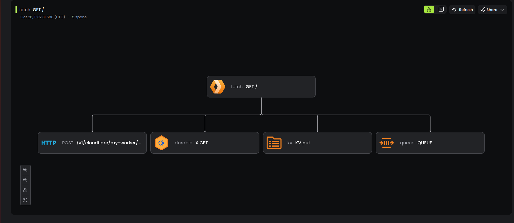

# OpenTelemetry for Cloudflare Workers

Instrument your [Cloudflare Worker](https://developers.cloudflare.com/workers/) applications with [OpenTelemetry](https://opentelemetry.io/) using the the [otel-cf-workers](https://github.com/evanderkoogh/otel-cf-workers) SDK.

---


## Instrumentation

### Step 1: Install the SDK


Install `@microlabs/otel-cf-workers` in your project.

```bash # :icon-terminal: terminal
npm i @microlabs/otel-cf-workers 
```

### Step 2: Add Node.js Compatibility Flags

OpenTelemetry requires the Node.js Compatibility flag is enabled at the top level of your wrangler.toml

```toml # :icon-code: wrangler.toml
compatibility_flags = [ "nodejs_compat" ]
```

### Step 3: Configure the tracer

In your Cloudflare worker file, add the following configuration code to configure OpenTelemetry.

```typescript #3-6,14-24 :icon-code: index.ts
import { instrument, ResolveConfigFn } from '@microlabs/otel-cf-workers'

export interface Env {
	BASELIME_API_KEY: string
    SERVICE_NAME: string
}

const handler = {
	async fetch(request: Request, env: Env, ctx: ExecutionContext): Promise<Response> {
		// your cloudflare worker code
	},
}

const config: ResolveConfigFn = (env: Env, _trigger) => {
	return {
		exporter: {
			url: 'https://otel.baselime.io/v1',
			headers: { 'x-api-key': env.BASELIME_API_KEY },
		},
		service: { name: env.SERVICE_NAME },
	}
}

export default instrument(handler, config)
```

### Step 4: Set the Baselime environment variables

In your [Cloudflare Workers Secret Configuration](https://developers.cloudflare.com/workers/configuration/secrets/) add the `BASELIME_API_KEY`. 

To enable tracing for local dev add your `BASELIME_API_KEY` to your `.dev.vars` file

```env # :icon-code: .dev.vars
BASELIME_API_KEY=$YOUR_BASELIME_API_KEY
```

In your `wrangler.toml` file set the `SERVICE_NAME` variable

!!!
Get your pulic BASELIME_API_KEY from the [Baselime console](https://console.baselime.io).
!!!

```txt # :icon-code: wrangler.toml
[vars]
SERVICE_NAME = "my-service-name"
```

Once these steps are completed, distributed traces from your Cloudflare workers application should be available in Baselime to query via the console or the Baselime CLI.



---

## Adding custom OpenTelemetry spans

To add custom spans to your OpenTelemetry traces, install the `@opentelemetry/api` package.

```bash # :icon-terminal: terminal
npm i @opentelemetry/api
```

And manually add spans to your traces.

```typescript # :icon-code: index.ts
import { trace } from "@opentelemetry/api";
 
const tracer = trace.getTracer('your-custom-traces');

const handler = {
    async fetch(request: Request, env: Env, ctx: ExecutionContext): Promise<Response> {
        const span = trace.getActiveSpan();

        span.setAttribute('search', search)

        const result = await tracer.startActiveSpan(`business-logic`, async (span) => {
            // your business logic
            const input = { search }
            span.setAttributes(input);
            const result = await yourBusinessLogic(input)
            span.setAttributes(result)
            return result
        });
    }
}
```
---

## Special Thanks

This is powered by [otel-cf-workers](https://github.com/evanderkoogh/otel-cf-workers) developed by [Erwin van der Koogh](https://github.com/evanderkoogh). It's a fantastic vendor agnostic OpenTelemetry SDK for Cloudflare Workers and you should check it out.