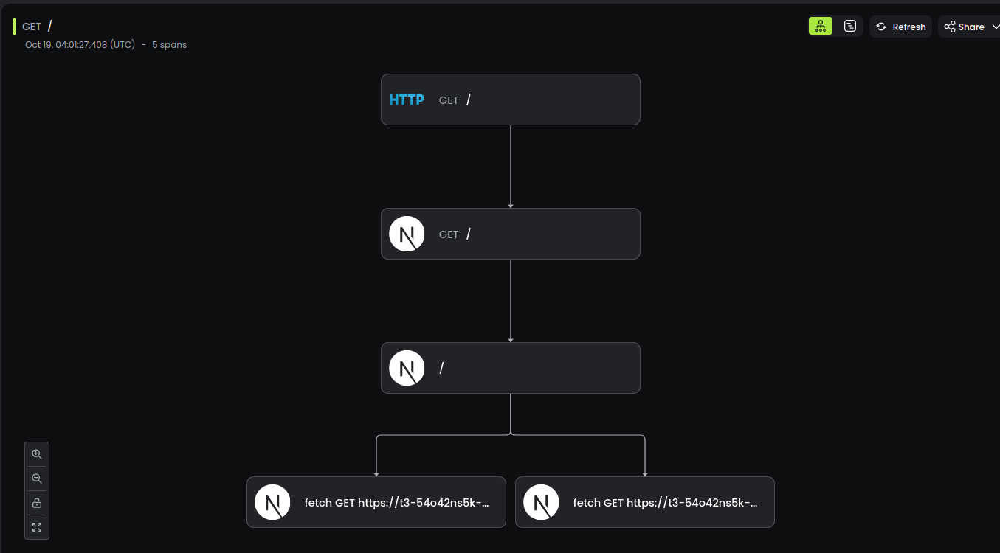

# OpenTelemetry for Next.js

Instrument your [Next.js](https://nextjs.org/) applications with [OpenTelemetry](https://opentelemetry.io/) using the the [Baselime Node.js OpenTelemetry SDK](https://github.com/baselime/node-opentelemetry).

!!!
If your deploy your Next.js applications on Vercel, install the [Vercel Baselime Integration](https://vercel.com/integrations/baselime) to enable logs in addition to distributed tracing.
!!!

---


## Instrumentation

### Step 1: Install the SDK


Install `@baselime/node-opentelemetry` in your project.

```bash # :icon-terminal: terminal
npm i @baselime/node-opentelemetry 
```

### Step 2: Initialise the tracer

Create a file `instrumentation.ts` in the root of your project and add the following code to configure and initialize OpenTelemetry.


```typescript # :icon-code: instrumentation.ts
export async function register() {
  if (process.env.NEXT_RUNTIME === 'nodejs') {
    const { BaselimeSDK, VercelPlugin, BetterHttpInstrumentation } = await import('@baselime/node-opentelemetry');

    const sdk = new BaselimeSDK({
      serverless: true,
      service: "your-project-name",
      instrumentations: [
        new BetterHttpInstrumentation({ 
          plugins: [
            new VercelPlugin() // Add the Vercel plugin to enable correlation between your logs and traces for projects deployed on Vercel
          ]
        }),
      ]
    });

    sdk.start();
  }
}
```

!!!
If you use a `/src` folder your project, add the `instrumentation.ts` file in the `/src` folder instead of the root folder.
!!!

### Step 3: Set the Baselime environment variables

Set the `BASELIME_KEY` environment variable to your Baselime public API Key. Get your pulic API key from the [Baselime console](https://console.baselime.io).


### Step 4. Enable Next.js Auto Instrumentation

Next.js 13.4+ supports auto-instrumentation. Add `experimental.instrumentationHook = true` to your [`next.config.js`](https://nextjs.org/docs/app/api-reference/next-config-js) to enable auto-instrumentation of all the requests your app makes to external services.


```typescript # :icon-code: next.config.mjs
await import("./src/env.mjs");

/** @type {import("next").NextConfig} */
const config = {
    experimental: {
        instrumentationHook: true,
    }
};

export default config;
```

Once these steps are completed, distributed traces from your Next.js applications should be available in Baselime to query via the console or the Baselime CLI.



---

## Tracing your tRPC applications

[tRPC](https://trpc.io/docs) is a framework that enables you to easily build & consume fully typesafe APIs without schemas or code generation. The Baselime Node OpenTelemetry SDK enables automatically tracing your tRPC applications with its [tRPC middleware](https://github.com/baselime/node-opentelemetry/blob/main/TRPC.md).

---

## Adding custom OpenTelemetry spans

To add custom spans to your OpenTelemetry traces, install the `@opentelemetry/api` package.

```bash # :icon-terminal: terminal
npm i @opentelemetry/api
```

And manually add spans to your traces.

```js # :icon-code: page.js
import { trace } from "@opentelemetry/api";
import { useSearchParams } from 'next/navigation'
 
const tracer = trace.getTracer('your-custom-traces');

export default async function Home({}) {
    const searchParams = useSearchParams()
 
  const search = searchParams.get('search')
  const span = trace.getActiveSpan();
  
  span.setAttribute('search', search)

  const result = await tracer.startActiveSpan(`business-logic`, async (span) => {
    // your business logic
    const input = { search }
    span.setAttributes(input);
    const result = await yourBusinessLogic(input)
    span.setAttributes(result)
    return result
  });

  return (
    <main className="flex min-h-screen ...">
      <div className="container flex flex-col items-center justify-center gap-12 px-4 py-16 ">
        ...
        </div>
    </main>
  )
}
```
---