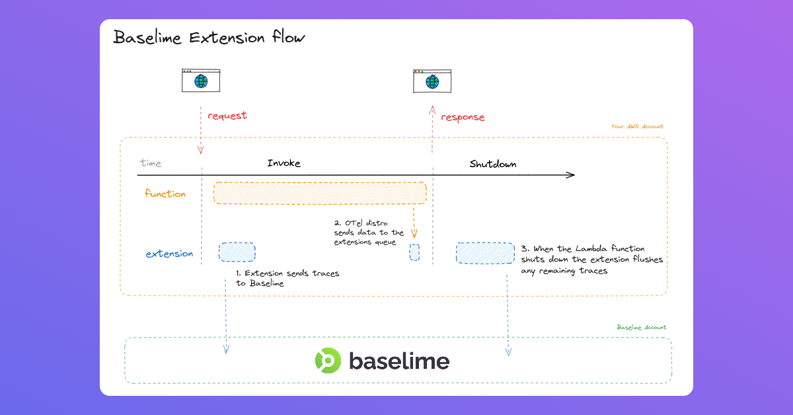

# Opentelemetry for Node.js on AWS Lambda

The [Baselime Node.js OpenTelemetry tracer for AWS Lambda](https://github.com/Baselime/lambda-node-opentelemetry) (Star us ⭐) instruments your Node.js AWS Lambda functions with OpenTelemetry and automatically sends the OpenTelemetry compatible trace data to Baselime. This is the most powerful and flexible way to instrument your Node.js AWS Lambda functions.

---

## Automatic Instrumentation

To automatically instrument your AWS Lambda functions with the [Baselime Node.js OpenTelemetry tracer for AWS Lambda](https://github.com/Baselime/lambda-node-opentelemetry), set the following tag to your AWS Lambda functions: `baselime:tracing=true`.

+++ AWS CDK

To add the Baselime tag to all your AWS Lambda functions in a service or stack add this line to your AWS CDK code.

```typescript
 Tags.of(app).add("baselime:tracing", `true`);
```

+++ SST

To add the Baselime tag to all your AWS Lambda functions in a service or stack add this line to your `sst.config.ts` file.

```typescript
 Tags.of(app).add("baselime:tracing", `true`);
```

+++ Serverless Framework

To add the Baselime tag to all your AWS Lambda functions in a add this snippet to your `serverless.yml` file.

```yaml
provider:
  name: aws
  tags:
    "baselime:tracing": "true"
```

+++ AWS SAM

To add the Baselime tag to all your AWS Lambda functions in a add this snippet to your AWS SAM configuration file.

```yaml
AWSTemplateFormatVersion: "2010-09-09"
Transform: AWS::Serverless-2016-10-31
Description: "Gets data from the xxxxx API."
Globals:
  Function:
    Tags:
       "baselime:tracing": "true"
```

+++

!!! Note
OpenTelemetry Automatic Instrumentation works only once you have connected your AWS Account to Baselime. Adding the tag to AWS Lambda functions in an AWS Account not connected to Baselime will not have any effect.
!!!

### How it works

The automatic instrumentation makes changes to your AWS Lambda functions once they are deployed:

- Add the Baselime Node.js OTel AWS Lambda Layer to your AWS Lambda function: `arn:aws:lambda:${region:097948374213:layer:baselime-node:6` - This layer is a slimmed down version of the [OpenTelemetry JavaScript Client](https://github.com/open-telemetry/opentelemetry-js) that will have minimal impact on the cold starts of your AWS Lambda functions
- Add the Baselime Extension added to your AWS Lambda function: `arn:aws:lambda:${region}:097948374213:layer:baselime-extension-${'x86_64' || 'arm64'}:1` - This extension enables the Baselime Layers to send the trace data to the Baselime backend after the invocation is complete, as such, distributed tracing will not have any negative impact on the latency of your AWS Lambda functions
- Set the `BASELIME_KEY` environment variable with the value of your environments Baselime API Key

These changes are kept in sync with your AWS Lambda function as you iterate on your architecture via events from Amazon CloudTrail.



---

## Manual Instrumentation

If you prefer to send the OpenTelemetry traces to Baselime manually, you can use the [Baselime Node.js OpenTelemetry tracer for AWS Lambda](https://github.com/Baselime/lambda-node-opentelemetry) (Star us ⭐) independently from connecting your AWS Account to Baselime.

### Step 1

Install the [Baselime Node.js OpenTelemetry tracer for AWS Lambda](https://github.com/Baselime/lambda-node-opentelemetry).

```bash
npm install @baselime/lambda-node-opentelemetry
```

### Step 2

Wrap the handlers of your AWS Lambda functions with the `baselime.wrap(handler)` method.

```javascript
import baselime from '@baselime/lambda-node-opentelemetry'

async function main(event, context) {
   // your handler logic
}

export const handler = baselime.wrap(main);
```

### Step 3

Set the environment variables of your AWS Lambda functions to include the Baselime API Key and set the NODE_OPTIONS enviroment variable to preload the OpenTelemetry SDK into your AWS Lambda bundle.

| Key          | Value                                       | Description                                                                         |
| ------------ | --------------------------------------------- | ----------------------------------------------------------------------------------- |
| BASELIME_KEY | <you-api-key>               | Get this key from the [cli](https://github.com/Baselime/cli) running `baselime iam` |
| NODE_OPTIONS | --require @baselime/lambda-node-opentelemetry | Preloads the OpenTelemetry SDK at startup                                                 |

### Step 4

Ensure that the OpenTelemetry SDK is included in the `.zip` file that is uploaded to AWS Lambda during your deployment. The step depends on your deployment framework.

+++ AWS CDK / SST

Set the default function props of your service to include the wrapper in the bundle and add the environment variables

```javascript
app.setDefaultFunctionProps({
  runtime: "nodejs18.x",
  environment: {
    NODE_OPTIONS: '--require @baselime/lambda-node-opentelemetry/lambda-wrapper',
    BASELIME_KEY: process.env.BASELIME_KEY
  },
  nodejs: {
    install: ["@baselime/lambda-node-opentelemetry"],
  },
});
```

+++ Serverless Framework

By default the Serverless Framework includes the entire `node_module` folder in the `.zip` bundle of your AWS Lambda functions. If you are using the `serverless-esbuild` plugin or any other plugin to prevent this, it is necessary to edit the configuration of your project.

Add the following line to the `package.patterns` block of your `serverless.yml` file.

```yaml
package:
  patterns:
    - 'node_modules/@baselime/lambda-node-opentelemetry'
```

Add the following environment variables

```yaml
    BASELIME_KEY: ${env:BASELIME_KEY}
    NODE_OPTIONS: '--require @baselime/lambda-node-opentelemetry/lambda-wrapper'
```

+++ Architect

Copy the `lambda-wrapper.js` file from the `node_modules` folder in the shared folder of your Architect project, it will be automatically included in all of your AWS Lambda `.zip` bundles.

```bash
cp node_modules/@baselime/lambda-node-opentelemetry/lambda-wrapper.js src/shared/
```

Add the environment variables to your architect project

```bash
arc env -e production --add BASELIME_KEY <your-api-key>
arc env -e production --add -- NODE_OPTIONS '--require @architect/shared/lambda-wrapper'
```

> Note the '--' in the NODE_OPTIONS command. This is required to escape options parsing.

+++


This method will however send the traces to the Baselime backend during the invocation of your AWS Lambda functions, and will result in a degradation in the latency performace of your functions.

In production we recommend additionally adding the Baselime AWS Lambda extension, as it will enable the OTel tracer to send traces to the Baselime backend after the excecution of your AWS Lambda functions.

```javascript
`arn:aws:lambda:${region}:097948374213:layer:baselime-extension-${'x86_64' || 'arm64'}:1`
```

---

## Send data to another OpenTelemetry backend

OpenTelemetry is an open standard, and you can use the [Baselime Node.js OpenTelemetry tracer for AWS Lambda](https://github.com/Baselime/lambda-node-opentelemetry) to send telemetry data to another backend of your choice.

Add the environment variable `COLLECTOR_URL` to send the data somewhere else than the Baselime backend.
