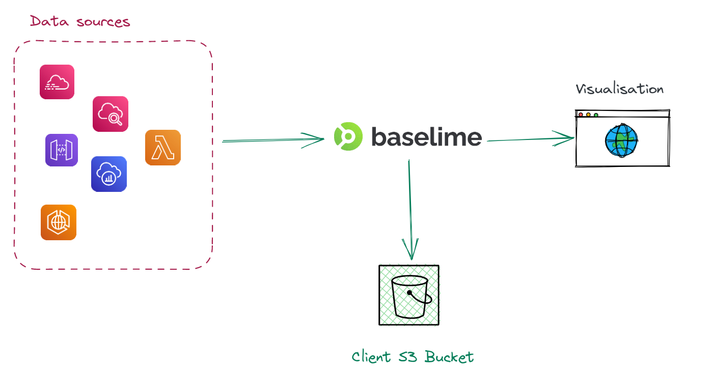

# Sending Data to Baselime

---


Baselime supports a variety of data sources, including logs, metrics, traces, and wide events. You can start sending your data to Baselime and gain valuable insights into the performance and reliability of your serverless applications with a few steps.

Once ingested, the data is securely stored hot storage for querying and in cold storage within your own AWS environment, in an **Amazon S3 bucket in your AWS account**. This ensures that you have complete long-term control over your data and its storage location.



You can send your telemetry data to Baselime with either of:

[!ref icon="../assets/images/logos/logo_aws_lambda.png"](./lambda-logs.md)
[!ref icon="../assets/images/logos/logo_ecs_logs.png"](./ecs-logs.md)
[!ref icon="../assets/images/logos/logo_aws_apigateway.png"](./apigateway-logs.md)
[!ref icon="../assets/images/logos/logo_aws_lambda.png"](./lambda-extension.md)
[!ref icon="../assets/images/logos/logo_open_telemetry.png"](./otel.md)
[!ref icon="../assets/images/logos/logo_xray.png"](./xray.md)
[!ref icon="../assets/images/logos/logo_cloudtrail.png"](./cloudtrail.md)
[!ref icon="../assets/images/logos/logo_cloudwatch.png"](./cloudwatch-metrics.md)
[!ref icon="../assets/images/logos/http_flat@3x.png"](./events-api.md)
[!ref icon="../assets/images/logos/s3@3x.png"](./s3-rehydration.md)
---

## Validation

Baselime has a size limit for events of `256kb`. This size limit helps ensure that the ingestion process is efficient and that the data stored in Baselime is manageable and fast to query. If an event exceeds this `256kb` size limit, it will not be ingested into Baselime.

--- 
## Sending Semi-Structured Logs to Baselime

Semi-structured logs are logs that are not in the strict JSON format, but still contain structured data that can be extracted.These logs contain a mixture of structured and unstructured data, making them difficult to parse and analyze. Fortunately, Baselime has built-in mechanisms to parse and extract relevant data from semi-structured logs.

Baselime will automatically detect log events that contain JSON data, but are prepended or appended by a generic string. 

The generic string will be wrapped in a `message` attribute, and the JSON data will be wrapped in a `data` attribute. This enables you to easily extract and analyze relevant data from semi-structured logs.

### Examples

Here are examples of automatic semi-structured logs detection.

||| Raw event
```txt
Events: { "key1": "value1", "key2": "value2", "key3": "value3" }
```
||| Parsed data
```json
{
  "message": "Events",
  "data": {
    "key1": "value1",
    "key2": "value2",
    "key3": "value3"
  }
}
```
||| 
||| Raw event
```txt
User Data {"user":{"id":"7467c534-3759-11ed-a261-0242ac120002","email":"john@jimbies.com","roles":["guest","owner"],"apiKey":"4ec86d09-d056-4a9b-af07-3a8b68bcb4cc","profile":{"dob":"1982-01-12","name":"John Doe","address":"46 Amherst Street, Boling, Virginia","company":"Jimbies","location":{"lat":-50.341738,"long":-26.114914}},"username":"jjred","createdAt":"2011-03-11T11:45:23.942Z","updatedAt":"2011-03-12T11:45:23.942Z"}}'
```
||| Parsed data
```json
{
  "message": "User Data",
  "data": {
    "user": {
      "id": "7467c534-3759-11ed-a261-0242ac120002",
      "email": "john@jimbies.com",
      "roles": [
        "guest",
        "owner"
      ],
      "apiKey": "4ec86d09-d056-4a9b-af07-3a8b68bcb4cc",
      "profile": {
        "dob": "1982-01-12",
        "name": "John Doe",
        "address": "46 Amherst Street, Boling, Virginia",
        "company": "Jimbies",
        "location": {
          "lat": -50.341738,
          "long": -26.114914
        }
      },
      "username": "jjred",
      "createdAt": "2011-03-11T11:45:23.942Z",
      "updatedAt": "2011-03-12T11:45:23.942Z"
    }
  }
}
```
||| 

||| Raw event
```txt
localdomain {"metadata":{"name":"Optimus","local_time_zone":"GMT+1","created_at":1631689974}} sudo[14170]
```
||| Parsed data
```json
{
  "message": "localdomain - sudo[14170]",
  "data": {
    "metadata": {
      "name": "Optimus",
      "local_time_zone": "GMT+1",
      "created_at": 1631689974
    }
  }
}
```
||| 


