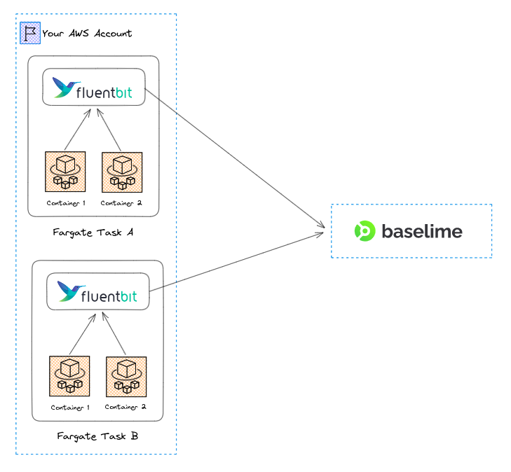
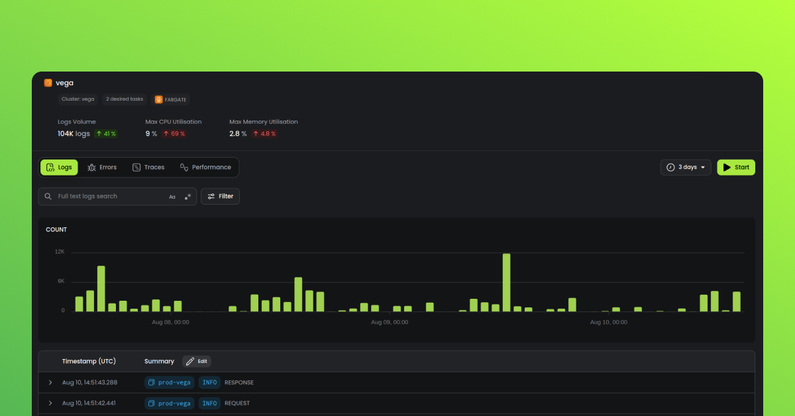

# Amazon ECS Container Logs

This page describes how to collect application container logs from [Amazon ECS](https://aws.amazon.com/ecs/) clusters launched with AWS ECS. Baselime supports to ways to get Amazon ECS logs:

- using Amazon CloudWatch logs
- using AWS FireLens.

---

## Using Amazon CloudWatch logs

If your ECS containers already publish logs to Amazon CloudWatch logs, Baselime automatically captures those logs using log subscription filters. There is no additional setup required.

Baselime also listens to newly deployed Amazon ECS containers and creates log subscription filters for those as soon as they are created.

---

## Using AWS Firelens

If you ECS containers don't publish logs to Amazon CloudWatch logs, you can send logs from your containers directly to Baselime using Firelens.

### How it works

[FireLens](https://aws.amazon.com/about-aws/whats-new/2019/11/aws-launches-firelens-log-router-for-amazon-ecs-and-aws-fargate/) is an Amazon ECS native log router that enables you to send logs from your containerized applications to different destinations, including Baselime. By adding the FireLens sidecar to your task definitions, you can configure and route your container logs to different destinations without modifying your application code.



Each of your ECS tasks can take a sidecar container running the FireLens log driver that will forward all the logs from the containers to Baselime.

---
### Configuring your ECS Tasks

#### Step 1: Obtaining your Baselime API Key

You can get your public Baselime API key in the [Baselime console](https://console.baselime.io) from the [Baselime CLI](../../../cli/install.md).

In the following instructions we will use `<BASELIME_API_KEY>` to refer to your Baselime API key.

#### Step 2: Adding the FireLens sidecar to your task definitions

Adding the FireLens sidecar to your task definitions is a straightforward process that can be accomplished using various Infrastructure as Code solutions or manually in the console.

Add the Baselime ECS endpoint to your FireLens configuration:
- Endpoint `ecs-logs-ingest.baselime.io`
- Header: `x-api-key <BASELIME_API_KEY>` 

+++ SST

```ts #
import { StackContext, Service } from "sst/constructs";
import { StringParameter } from 'aws-cdk-lib/aws-ssm';
import * as ecs from 'aws-cdk-lib/aws-ecs';

export function API({ stack }: StackContext) {
  const key = StringParameter.valueForStringParameter(stack, 'baselime-key');
  
  const service = new Service(stack, 'sst-service', {
    path: './',
    environment: {
      BASELIME_KEY: key
    },
    cdk: {
      container: {
        logging: new ecs.FireLensLogDriver({
          options: {
            "Name": "http",
            "Host": "ecs-logs-ingest.baselime.io",
            "Port": "443",
            "TLS": "on",
            "format": "json",
            "retry_limit": "2",
            "header": `x-api-key ${key}`,
          },
        }),
      }
    }
  });

  stack.addOutputs({
    URL: service.url
  })
}
```
+++ Terraform

```hcl #
resource "aws_ecs_task_definition" "example_task" {
  family                = "example-task"
  container_definitions = jsonencode([
    {
      name              = "example-container"
      image             = "example-image:latest"
      log_configuration {
        log_driver      = "awsfirelens"
        options = {
          "Name"        = "http"
          "Host"        = "ecs-logs-ingest.baselime.io"
          "Port"        = "443"
          "TLS"         = "on"
          "format"      = "json"
          "retry_limit" = "2"
          "header"      = "x-api-key <BASELIME_API_KEY>"
        }
      }
    }
  ])
}
```

+++ AWS CDK

```ts #
import * as ecs from "aws-cdk-lib/aws-ecs";

const taskDef = new ecs.FargateTaskDefinition(this, "your_ecs_worker", {
    memoryLimitMiB: 1024,
});

taskDef.addContainer("container", {
  containerName: "your-container",
  logging: new ecs.FireLensLogDriver({
    options: {
      "Name": "http",
      "Host": "ecs-logs-ingest.baselime.io",
      "Port": "443",
      "TLS": "on",
      "format": "json",
      "retry_limit": "2",
      "header": `x-api-key <BASELIME_API_KEY>`,
    },
  }),
});

```

+++ Directly in AWS console

```json #
{
  "containerDefinitions": [
    {
      "name": "log-router",
      "image": "906394416424.dkr.ecr.eu-west-1.amazonaws.com/aws-for-fluent-bit:latest"
    },
    {
      "name": "your-container",
      "image": "1234567891234.dkr.ecr.eu-west-1.amazonaws.com/your-image",
      "logConfiguration": {
        "logDriver": "awsfirelens",
        "options": {
          "Host": "ecs-logs-ingest.baselime.io",
          "Name": "http",
          "Port": "443",
          "TLS": "on",
          "format": "json",
          "header": "x-api-key <BASELIME_API_KEY>",
          "retry_limit": "2"
        },
        "secretOptions": []
      }
    }
  ]
}
```
+++



---

## Troubleshooting

If you're having trouble sending data from your AWS ECS logs to Baselime, here are a few things to check:

- Verify that you're using the correct API key and host in the FireLens configuration
- Make sure that your containers are receiving traffic and are writing logs to either `stdout` or `stderr`
- Check the logs of the FireLens container to look for any anomaly
