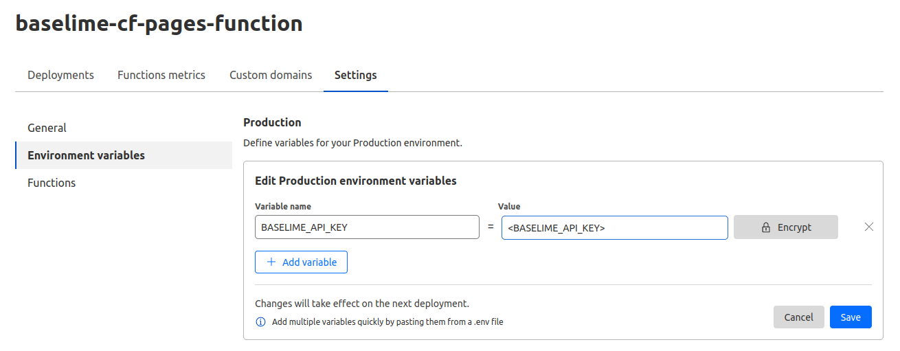

# Cloudflare Pages

[Cloudflare Pages](https://developers.cloudflare.com/pages/) is a frontend app development platform. Baselime enabled your to capture the server-side logs of your applications deployed on Cloudflare pages.

---


You can setup logs for Cloudflare Pages Functions in 4 steps.

**Step 1:** Install the [@baselime/edge-logger](https://github.com/baselime/edge-logger) package.

```bash # :icon-terminal: terminal
npm i -S @baselime/edge-logger
```

**Step 2:** Add the logger to your server-side code in the `functions` directory
 

```javascript #1,4-10,12,14 :icon-code: functions/index.js
import { BaselimeLogger } from "@baselime/edge-logger"

export function onRequest(context) {
  const logger = new BaselimeLogger({
    service: "your-service-name"
    namespace: context.request.url
    apiKey: context.env.BASELIME_API_KEY,
    ctx: context,
    isLocalDev: context.env.IS_LOCAL
  });

  logger.info("Hello from the serverless world!", { data: { userId: 'random-id' } });

  context.waitUntil(logger.flush());
  return new Response(JSON.stringify({
    message: "Hello from the serverless world!"
  }));
} 
```

!!!
Remember to call `logger.flush()`, otherwise the execution will terminate before logs are forwarded to Baselime.
!!!

**Step 3:** Add the `BASELIME_API_KEY` environment variable to your Cloudflare pages settings and deploy your application

!!!
Get your public `BASELIME_API_KEY` from the [Baselime Console](https://console.baselime.io/)
!!!



**Step 4:** View your logs in the [Baselime Console](https://console.baselime.io)

---

## Special cases

There are special cases for instrumenting applications on Cloudflare Pages depending on the web framework.  

### SvelteKit

Additional steps are necessary to instrument applications developed with [SvelteKit](https://kit.svelte.dev/).

**Step 1:** Update the `build` and `deploy` scripts in your project `package.json` 

```json #5-6 :icon-code: package.json
{
  "name": "my-svelte-app",
  "scripts": {
    ...
  	"build": "CF_PAGES=1 vite build",
    "deploy": "npm run build && wrangler pages deploy .svelte-kit/cloudflare",
    ...
  },
  ...
}    
```

**Step 2:** Add the Baselime logger to your `hook.server.js` file

```javascript # :icon-code: src/hook.server.js
import { BaselimeLogger } from "@baselime/edge-logger";

export const handle = async ({ event, resolve }: { event: any, resolve: any}) => {
  const baselimeApiKey = String(event.platform?.env?.BASELIME_API_KEY);

  const context = event.platform?.context || { waitUntil: () => {}, passThroughOnException: () => {} }
  const logger = new BaselimeLogger({
    service: 'your-service-name',
    namespace: event.request.url,
    apiKey: baselimeApiKey,
    isLocalDev: event.platform ? false : true,
    ctx: context
  });
  
  event.logger = logger;

  const result = await resolve(event);

  context.waitUntil(logger.flush());
  return result;
};
```

**Step 3:** Access the Baselime logger in the server-side code 


```javascript # :icon-code: src/routes/page.server.ts
import type { BaselimeLogger } from '@baselime/edge-logger';

export async function load({ logger }) {
  logger.info("Hello from page.server.ts")
  return {
    data: Math.random(),
    message: "hello"
  };
}
```
