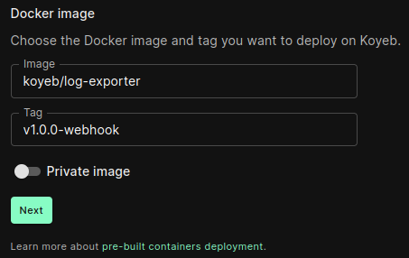

# Koyeb Logs
[Koyeb](https://koyeb.com) is a serverless platform that enables you to run applications without having to manage servers and infrastructure. You can stream your Koyeb services logs to Baselime using their log exporter.

---

Streaming logs from Koyeb to Baselime required a Koyeb API Key and a Koyeb Logger service.

## Generate your Koyeb API Key

Generate your Koyeb API Key in 4 steps:

1. Select the organisation you want to add logging to.
2. Navigate to "Organization Settings"
3. Select "API" from left-hand menu
4. Create new API key and copy it for later

---

## Create a logger service

Create a Logger service in Koyeb. This service will stream logs from your Koyeb services in real-time to Baselime.

1. Create a new Docker App in Koyeb
2. Use the `koyeb/log-exporter` image with "Tag" `v1.0.0-webhook`

3. Add environment variables to the new app

4. Add the following environment variables:

Variable Name | Variable Value
---           | ---
`WEBHOOK_URI`   | `https://events.baselime.io/v1/koyeb`
`WEBHOOK_TOKEN` | `BASELIME_API_KEY`
`KOYEB_TOKEN`   | `KOYEB_TOKEN`
`KOYEB_SERVICE` | `app-name/service-name`

!!!
Replace 
- `BASELIME_API_KEY` with your public `BASELIME_API_KEY`
- `KOYEB_TOKEN` with the Koyeb API Key generated in the first step
- `app-name` with the name of your Koyeb app
- `service-name` with the name of the service within your Koyeb app you want to stream logs to Baselime.
!!!

!!!
Get your public `BASELIME_API_KEY` from the [Baselime console](https://console.baselime.io)
!!!

5. Deploy the logger service.

Once the service is deployed logs from your Koyeb application will be available to query in the [Baselime console](https://console.baselime.io).